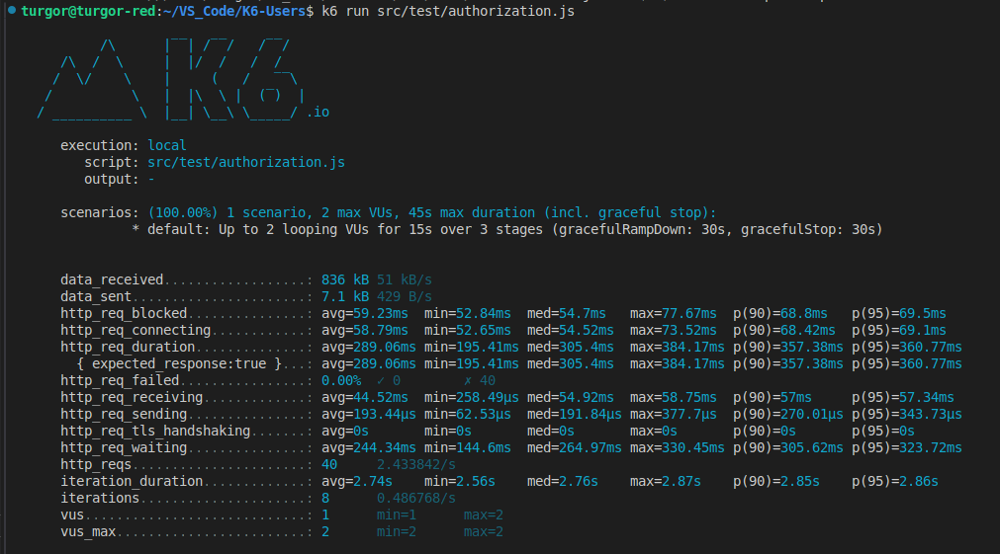

# K6-Users

### Описание

Цель проекта: получение навыков в написание автоматиче

## Технологии

- K6
- Grafana
- InfluxDB
- JS
- docker-compose

## Запуск тестов

k6 run src/test/<название теста>

## Мониторинг

Графики в Grafana

